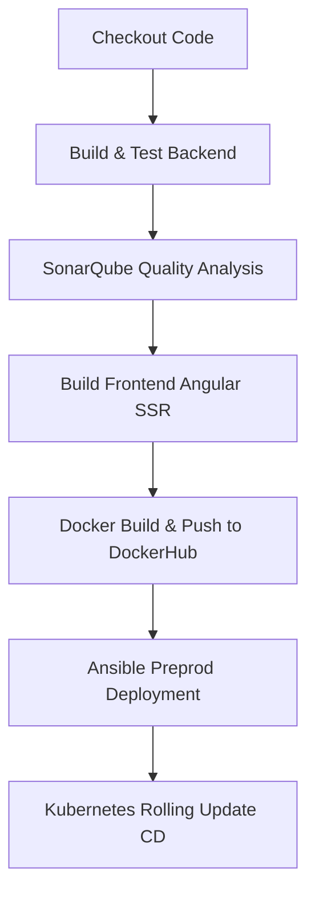

# 🏋️‍♂️ SmartTrainer - AI-Powered Fitness Platform

[](https://angular.dev/)
[](https://spring.io/projects/spring-boot)
[](https://www.docker.com/)
[](https://kubernetes.io/)
[](https://www.jenkins.io/)

SmartTrainer is a premium, multi-tenant AI-driven fitness and workout orchestration platform. It connects clients, certified coaches, fitness clubs, and platform administrators through a feature-rich, high-performance web experience. Powered by an Angular 19 frontend with Server-Side Rendering (SSR) and a Spring Boot 3 backend, SmartTrainer leverages AI to help coaches design personalized workout routines and manage clients seamlessly.

---

## 🌟 Key Features by Role

### 👤 1. Clients
* **Interactive Dashboard**: Modern glassmorphic personal layout showcasing workout routines, progress metrics, and upcoming training sessions.
* **Nutrition Hub**: Dedicated guide to custom meal plans, recipes, and nutritional recommendations.
* **Direct Communication**: Integrated instant messaging to chat directly with personal coaches.
* **Profile Management**: Role-specific onboarding forms to specify fitness goals, metrics, and profiles.

### 📋 2. Coaches
* **AI Program Assistant**: An intelligent virtual assistant that assists coaches in writing, structuring, and generating custom workout plans.
* **Client Manager**: Comprehensive view of client list, progress monitoring, completion rates, and historical logs.
* **Interactive Scheduler**: Calendar interface to coordinate check-ins, personal training slots, and scheduling.
* **Community Space**: Collaborative hub to post updates, share fitness articles, and engage with followers.

### 🏢 3. Clubs
* **Club Dashboard**: Business metrics highlighting active member counts, revenues, transaction logs, and operations.
* **Coach Management**: Direct interface to onboard, affiliate, and manage coaches connected to the club.

### 🔑 4. Administrators
* **System-Wide Dashboard**: Global system control, user account moderation, database management, and service health checks.
* **Exercise Catalog curation**: Admin-only exercise repository and system workouts control.

---

## 🛠️ Architecture & Tech Stack

### Frontend
* **Core Framework**: Angular `19.2.0` with **Server-Side Rendering (SSR)** enabled.
* **State Management**: Reactive data flows using modern **Angular Signals**.
* **Styling**: Tailwind CSS `v3.4.19` utilizing custom theme parameters for a premium glassmorphic dark-and-light UI theme.
* **Security**: Bearer JWT interception via dynamic Angular HTTP interceptors.

### Backend
* **Core Engine**: Java `17` & Spring Boot `3.5.13` (Web, Data JPA, Validation, Security).
* **Security & Auth**: Spring Security with custom JWT token validation and role-based access control.
* **Database**: PostgreSQL `16` Database engine.
* **API Documentation**: OpenAPI/Swagger UI integration via `springdoc-openapi`.

### DevOps & Infrastructure
* **Containerization**: Multi-container setup with Docker and Docker Compose.
* **CI/CD Automation**: Fully automated Jenkins pipeline including:
  * **Code Quality Analysis**: SonarQube Scanner integration.
  * **Registry Delivery**: Automatic Docker Hub build & push.
  * **Infrastructure Orchestration**: Ansible playbook deployments to pre-production environments.
  * **Kubernetes (CD)**: Kubectl deployment configuration supporting Horizontal Pod Autoscaler (HPA) and zero-downtime rolling updates.

---

## 📂 Project Structure

```bash
AI-fitness-platform/
├── backend/                  # Spring Boot 3 Maven Project
│   ├── src/main/java/        # Java source code
│   │   └── org/smarttrainer/backend/
│   │       ├── auth/         # Authentication modules (controllers, DTOs, services)
│   │       ├── config/       # Core Spring configs (CORS, Swagger)
│   │       ├── domain/       # Shared JPA domain entities
│   │       ├── modules/      # Domain modules (exercise, coach, club, client, admin)
│   │       └── security/     # Spring Security, JWT filters & services
│   ├── src/main/resources/   # Application properties & templates
│   ├── Dockerfile            # Backend Docker image config
│   └── pom.xml               # Maven configuration & dependencies
│
├── frontend/                 # Angular 19 SSR Application
│   ├── src/app/
│   │   ├── core/             # Global services, models, guards & interceptors
│   │   ├── features/         # Features split by public/private roles
│   │   └── shared/           # Transversal navbar, footer & sidebar layouts
│   ├── Dockerfile            # Frontend SSR Docker image config
│   ├── tailwind.config.js    # Tailwind layout customization
│   └── package.json          # Node dependencies & Angular build configurations
│
├── ansible/                  # Ansible playbooks and host files
│   ├── deploy-playbook.yml   # Docker compose pre-production runner
│   └── inventory.ini         # Preprod server endpoints
│
├── Jenkinsfile               # Multi-stage CI/CD pipeline script
└── docker-compose.yml        # Local orchestrated development environment
```

---

## 🚀 Getting Started

### Prerequisites
Make sure you have the following installed on your machine:
* [Docker & Docker Compose](https://www.docker.com/)
* [Node.js (v20+)](https://nodejs.org/) & npm
* [Java Development Kit (JDK 17)](https://adoptium.net/)
* [Maven (v3.9+)](https://maven.apache.org/)

---

### 🐳 1. Running Locally with Docker Compose (Recommended)

1. Create a `.env` file in the root directory and configure the database environment variables:
   ```env
   DB_NAME=smarttrainer
   DB_USER=postgres
   DB_PASSWORD=your_secure_password
   SECRET_KEY=your_base64_jwt_signing_key_at_least_256_bits_long
   SECRET_EXPIRATION=86400000
   ```

2. Spin up all services (PostgreSQL, Backend API, Frontend SSR):
   ```bash
   docker compose up -d --build
   ```

3. The services will be accessible at:
   * **Frontend Application**: [http://localhost:80](http://localhost:80)
   * **Backend Rest API**: [http://localhost:8082](http://localhost:8082)
   * **Swagger API Documentation**: [http://localhost:8082/swagger-ui/index.html](http://localhost:8082/swagger-ui/index.html)

---

### 💻 2. Manual Development Setup

#### Running the Backend API
1. Navigate to the `backend` folder:
   ```bash
   cd backend
   ```
2. Make sure you have a running PostgreSQL database configured in `backend/src/main/resources/application.properties` (or set up matching environment variables).
3. Run the Spring Boot application using the Maven wrapper:
   * **Windows**:
     ```bash
     .\mvnw.cmd spring-boot:run
     ```
   * **Linux/macOS**:
     ```bash
     ./mvnw spring-boot:run
     ```

#### Running the Frontend Client
1. Navigate to the `frontend` folder:
   ```bash
   cd frontend
   ```
2. Install the dependencies:
   ```bash
   npm install
   ```
3. Start the Angular local development server:
   ```bash
   npm run start
   ```
4. Access the client panel at [http://localhost:4200](http://localhost:4200).

---

## 🛠️ CI/CD Deployment Flow

The project employs a robust multi-stage pipeline configured in the `Jenkinsfile`:



1. **Checkout**: Jenkins pulls the latest code from the main repository.
2. **Build & Test Backend**: Maven compiles the Java code and creates a package package (`.jar`).
3. **SonarQube Quality Analysis**: Code analyzer checks the backend sources for vulnerabilities, code smell, and styling compliance.
4. **Build Frontend**: Compiles Angular components and prepares build distributions.
5. **Docker Build & Push**: Automatically builds container images for the backend and frontend and pushes them to Docker Hub.
6. **Ansible Deploy**: Executes Ansible playbooks to update the pre-production environment.
7. **Kubernetes (CD)**: Restarts deployments with a rolling restart (`rollout restart`) on the target cluster ensuring zero-downtime updates and configuring scaling policies.
